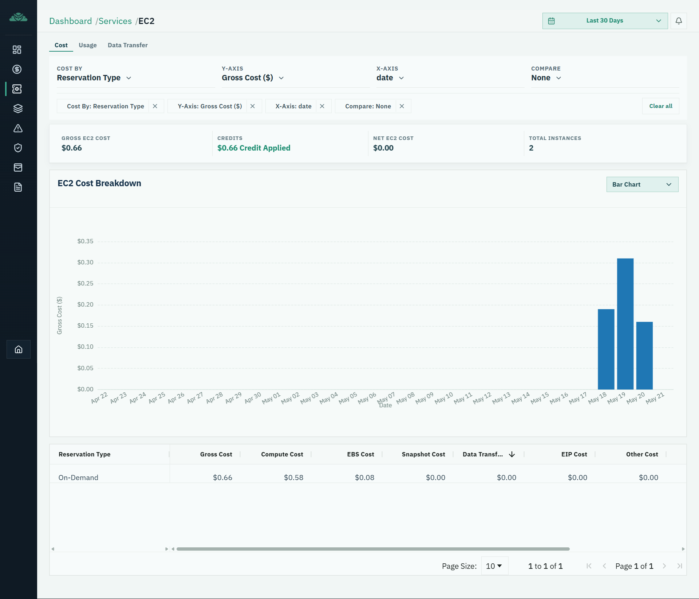
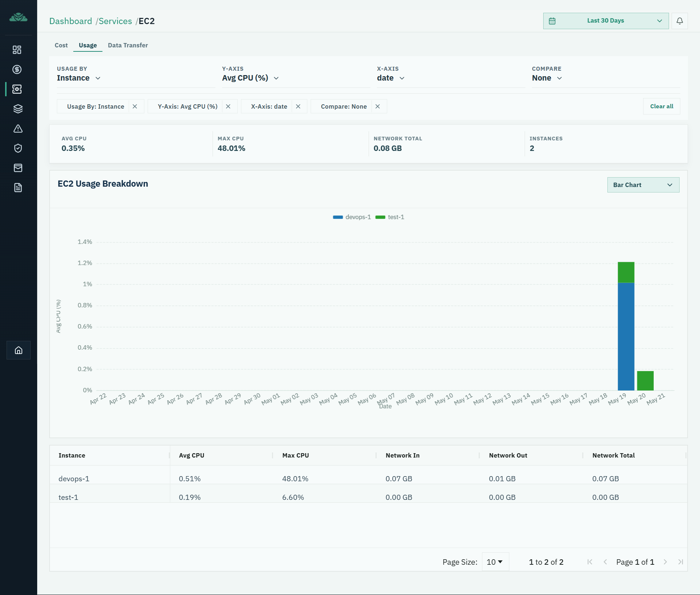
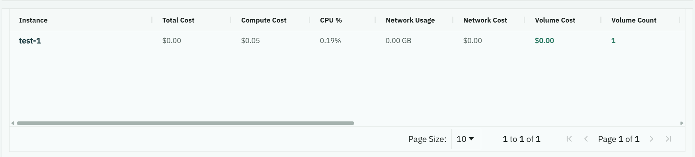
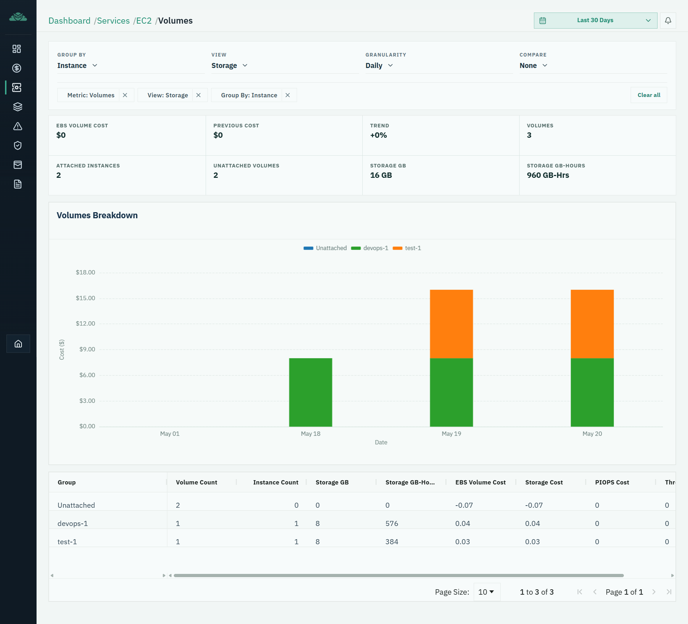
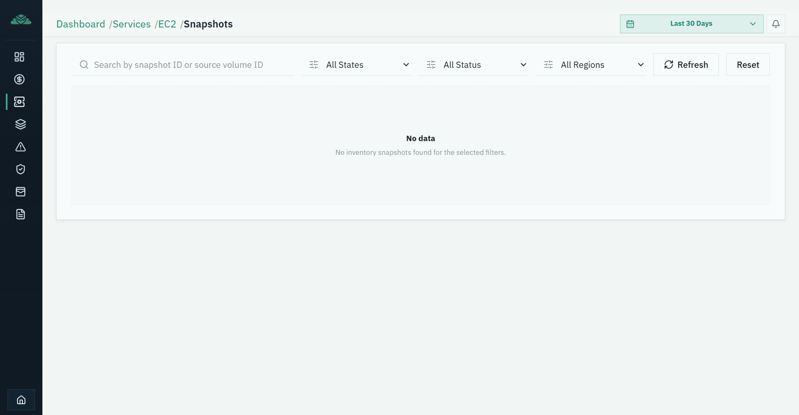
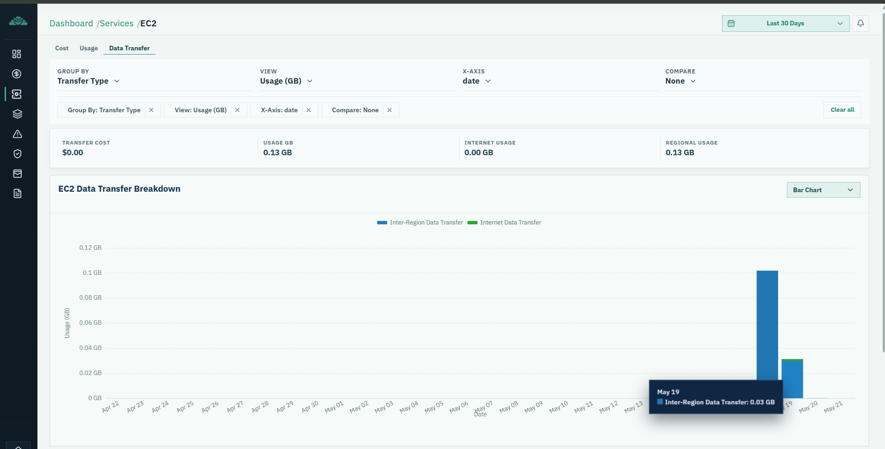
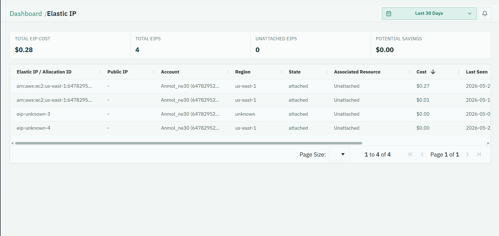
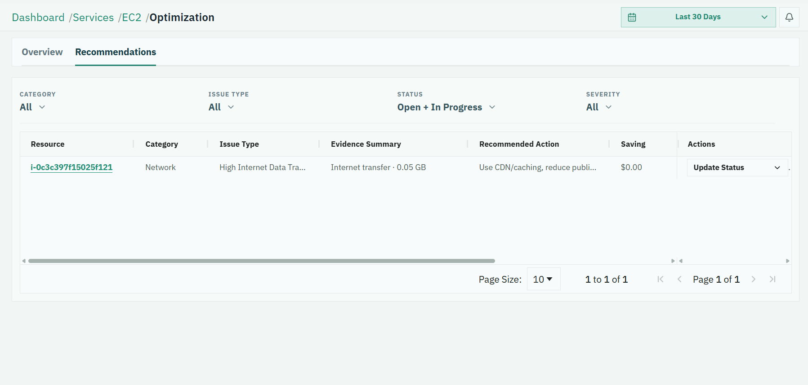

# EC2 Functional Requirements Document

## 1. Document Overview
- Document Title: EC2 Module FRD
- Product: KCX FinOps Platform
- Audience: Product Manager, Designers, Frontend Team, Backend Team, QA Team
- Version: 2.0 (business + UX enhanced)
- Purpose: Define what the EC2 module does, why it exists, how users move through it, and how it is implemented.

## 2. Module Purpose
The EC2 module helps teams understand and optimize EC2 spend and usage by connecting high-level trends to resource-level investigation and recommendation workflows.

## 3. Business Goal
- Improve EC2 cost transparency across:
  - Compute
  - EBS
  - Snapshot
  - Data Transfer
  - EIP/Public IPv4
  - Other EC2
- Reduce mean time to explain cost spikes.
- Convert analysis into action through recommendations and status tracking.

## 4. User Roles
- FinOps Analyst: investigates spend anomalies and optimization opportunities.
- Cloud Operations Engineer: validates resource behavior and applies operational actions.
- Engineering/Platform Manager: monitors efficiency posture and prioritizes remediation.
- QA Team: validates data flow, drilldowns, and workflow states end-to-end.

## 5. Scope
Pages in scope:
- EC2 Overview (via EC2 Explorer default state)
- EC2 Explorer
- EC2 Instance List
- EC2 Instance Detail
- EC2 Volumes List
- EC2 Volume Detail
- EC2 Snapshot List
- EC2 Data Transfer Page
- EC2 Elastic IP Page
- EC2 Recommendation Page

## 6. Out of Scope
- Load Balancer module behavior and recommendation lifecycle.
- S3, Database, and non-EC2 service modules.
- Implementation refactors not required for current release.

## 7. Navigation Sitemap
- `Services > EC2`
  - Instances -> `/dashboard/inventory/aws/ec2/instances`
  - Volumes -> `/dashboard/inventory/aws/ec2/volumes`
  - Snapshots -> `/dashboard/inventory/aws/ec2/snapshots`
  - Optimization -> `/dashboard/ec2/optimization`
  - Elastic IP -> `/dashboard/inventory/aws/ec2/elastic-ip`
- Explorer entry: `/dashboard/ec2/explorer`
- Data transfer short route: `/dashboard/ec2/network/data-transfer` (redirects to Explorer metric mode)

## 8. Page-by-Page Functional Requirements

### 8.1 EC2 Overview (Explorer default context)
#### 1. Business Purpose
Provide a fast health check of EC2 cost and usage so users can identify where investigation is needed.
#### 2. User Problem Solved
Users cannot act on raw billing files. They need a visual starting point.
#### 3. User Workflow
Open EC2 Explorer -> review KPIs + trend + grouped table -> click suspicious segment(instance page) ( explorer to instance page navigation).
#### 4. Why This Navigation Exists
Navigation from summary to filtered detail avoids manual re-filtering and speeds root-cause analysis.
#### 5. Expected User Outcome
User identifies the likely cost/usage driver and moves into a scoped list page.
#### 6. UX Behavior
Metric controls, group-by, filter chips, clear-all, loading skeletons, empty states.
#### 7. Functional Behavior
Renders summary cards + chart + grouped table for selected metric and filters.
#### 8. Technical/API Notes
- Route: `/dashboard/ec2/explorer`
- APIs:
  - `POST /ec2/explorer/cost`
  - `POST /ec2/explorer/usage`
  - `POST /ec2/explorer/data-transfer`
  - `GET /dashboard/ec2/explorer` (fallback path)
- Query context: dates, metric/groupBy, usageType, scope filters.

### 8.2 EC2 Explorer
#### 1. Business Purpose
Give a single analysis surface for EC2 spend and behavior across major metrics.
#### 2. User Problem Solved
Teams need to compare different cost and usage perspectives without switching modules.
#### 3. User Workflow
Select metric -> refine filters/grouping -> inspect graph/table -> drill into list/detail pages.
#### 4. Why This Navigation Exists
Explorer is the bridge from �what changed� to �which resources caused it.�
#### 5. Expected User Outcome
User can explain cost/usage movement and identify candidate resources quickly.
#### 6. UX Behavior
Five metric modes:
1. Cost
2. Usage
3. Instances
4. Volumes
5. Data Transfer
#### 7. Functional Behavior
- Graph click -> filtered list page
- Table row click -> filtered list page
- Recommendation shortcut actions route to optimization page
#### 8. Technical/API Notes
- Main route: `/dashboard/ec2/explorer`
- Uses v2 POST endpoints for cost/usage/data-transfer; legacy GET endpoint remains.
- Core params: `metric`, `groupBy`, `startDate/endDate`, scope filters.

### 8.3 EC2 Instance List
#### 1. Business Purpose
Provide a practical, sortable inventory view to isolate cost/usage contributors.
#### 2. User Problem Solved
Users need a concrete list of impacted instances after seeing a spike on charts.
#### 3. User Workflow
Arrive from Explorer drilldown -> validate filtered instance set -> open specific instance.
#### 4. Why This Navigation Exists
It turns abstract trend signals into actionable resource-level investigation.
#### 5. Expected User Outcome
User identifies top offending or idle instances and escalates to detail/recommendation actions.
#### 6. UX Behavior
Search, filter, pagination, sortable columns, row click to detail.
#### 7. Functional Behavior
Shows instance inventory enriched with cost/usage/optimization context.
#### 8. Technical/API Notes
- Route: `/dashboard/inventory/aws/ec2/instances`
- APIs:
  - `GET /inventory/aws/ec2/instances`
  - `GET /inventory/aws/ec2/instances/performance` (when required)

### 8.4 EC2 Instance Detail
#### 1. Business Purpose
Show full context for one instance before making cost or operational decisions.
#### 2. User Problem Solved
List views are insufficient to decide if a resource should be resized, stopped, or kept.
#### 3. User Workflow
Open from list -> review performance/cost context -> check recommendations -> decide next action.
#### 4. Why This Navigation Exists
Users need a deep-dive screen that consolidates signals before action.
#### 5. Expected User Outcome
Confident decision on whether the instance is healthy, underused, or optimization-ready.
#### 6. UX Behavior
Sectioned detail layout, trend sections, related recommendation context.
#### 7. Functional Behavior
Fetches instance detail and performance context; preserves date/scope context.
#### 8. Technical/API Notes
- Route: `/dashboard/inventory/aws/ec2/instances/:instanceId`
- APIs:
  - `GET /inventory/aws/ec2/instances/:instanceId/details`
  - `GET /inventory/aws/ec2/instances/performance`

### 8.5 EC2 Volumes List
#### 1. Business Purpose
Track storage cost and identify underused/unattached volumes.
#### 2. User Problem Solved
Storage waste is often hidden unless attachment and utilization are visible together.
#### 3. User Workflow
Open volume list -> filter by state/type -> inspect unattached/expensive rows -> open detail.
#### 4. Why This Navigation Exists
Separating storage investigation avoids confusion with compute-only analysis.
#### 5. Expected User Outcome
User identifies reclaimable storage opportunities quickly.
#### 6. UX Behavior
Table-first interface with storage-specific filters and clear row actions.
#### 7. Functional Behavior
Displays volume inventory + performance/cost fields with drilldown to detail.
#### 8. Technical/API Notes
- Route: `/dashboard/inventory/aws/ec2/volumes`
- APIs:
  - `GET /inventory/aws/ec2/volumes`
  - `GET /inventory/aws/ec2/volumes/performance`

### 8.6 EC2 Volume Detail
#### 1. Business Purpose
Provide volume-level evidence to confirm optimization decisions.
#### 2. User Problem Solved
Users need to understand if volume size/type/attachment aligns with workload need.
#### 3. User Workflow
Open from list -> inspect metadata/performance/cost -> decide keep/right-size/cleanup path.
#### 4. Why This Navigation Exists
Detail-level evidence reduces risky cleanup actions.
#### 5. Expected User Outcome
User can justify storage optimization actions with data.
#### 6. UX Behavior
Sectioned detail page with trend and metadata context.
#### 7. Functional Behavior
Loads detailed volume data and performance context.
#### 8. Technical/API Notes
- Route: `/dashboard/inventory/aws/ec2/volumes/:volumeId`
- APIs:
  - `GET /inventory/aws/ec2/volumes/:volumeId/details`
  - `GET /inventory/aws/ec2/volumes/performance`

### 8.7 EC2 Snapshot List
#### 1. Business Purpose
Expose snapshot sprawl and retention-related storage cost risk.
#### 2. User Problem Solved
Old/orphaned snapshots accumulate unnoticed and create cost drag.
#### 3. User Workflow
Review snapshot rows -> identify old/orphaned candidates -> navigate to related volume if available.
#### 4. Why This Navigation Exists
Linking snapshot to volume gives operational context for retention decisions.
#### 5. Expected User Outcome
User can prioritize cleanup and retention policy improvements.
#### 6. UX Behavior
Snapshot table with searchable/filterable columns; relationship-aware navigation.
#### 7. Functional Behavior
Snapshot click routes to related volume where mapping exists.
#### 8. Technical/API Notes
- Route: `/dashboard/inventory/aws/ec2/snapshots`
- API: `GET /inventory/aws/ec2/snapshots`

### 8.8 EC2 Data Transfer Page
#### 1. Business Purpose
Break down network-related EC2 charges and usage signals.
#### 2. User Problem Solved
Data transfer costs are hard to interpret without category-level views.
#### 3. User Workflow
Open data transfer mode -> inspect transfer type trends -> drill into affected resources.
#### 4. Why This Navigation Exists
Users must pivot from network trend anomalies to resource-level contributors.
#### 5. Expected User Outcome
User can explain data transfer spikes and target remediation.
#### 6. UX Behavior
Explorer-like chart/table behavior in data-transfer metric mode.
#### 7. Functional Behavior
Supports grouped transfer analytics and drilldowns.
#### 8. Technical/API Notes
- Canonical behavior currently via Explorer `metric=data-transfer`
- APIs:
  - `POST /ec2/explorer/data-transfer`
  - `GET /dashboard/ec2/data-transfer` (legacy support)

### 8.9 EC2 Elastic IP Page
#### 1. Business Purpose
Expose EIP/Public IPv4 cost and unattached-IP waste.
#### 2. User Problem Solved
Unattached or low-value IP allocations often go unnoticed.
#### 3. User Workflow
Filter by scope -> review attachment/cost -> navigate to related resource when needed.
#### 4. Why This Navigation Exists
Allows direct investigation of IP-driven EC2 cost components.
#### 5. Expected User Outcome
User identifies releasable or misconfigured IP allocations.
#### 6. UX Behavior
Table-centric flow with clear attachment visibility.
#### 7. Functional Behavior
Lists EIP records with cost and linkage context.
#### 8. Technical/API Notes
- Route: `/dashboard/inventory/aws/ec2/elastic-ip`
- API path: `GET /dashboard/ec2/elastic-ips`

### 8.10 EC2 Recommendation Page
#### 1. Business Purpose
Convert investigation findings into a managed optimization backlog.
#### 2. User Problem Solved
Without workflow states, recommendations become static reports with no operational follow-through.
#### 3. User Workflow
Open optimization page -> filter recommendations -> open detail -> update status -> track progress.
#### 4. Why This Navigation Exists
Links analytical discovery to execution-oriented FinOps operations.
#### 5. Expected User Outcome
Teams move from insight to measurable optimization actions.
#### 6. UX Behavior
Overview + recommendation tabs, filter controls, status action menus, detail/modal view.
#### 7. Functional Behavior
Supports list/refresh/status lifecycle transitions and resource navigation.
#### 8. Technical/API Notes
- Route: `/dashboard/ec2/optimization`
- APIs:
  - `GET /dashboard/ec2/recommendations`
  - `POST /dashboard/ec2/recommendations/refresh`
  - `PATCH /dashboard/ec2/recommendations/:id/status`

## 9. Filters
- Shared scope filters: date range, region, tags.
- Explorer filters: metric, group-by, group values, cost basis, usage/data transfer controls.
- Inventory filters: search, state/type/status, pagination/sort.
- Recommendation filters: category, issue type, status, severity/risk, search.

## 10. KPIs / Metrics
- EC2 cost includes:
  - Compute
  - EBS
  - Snapshot
  - Data Transfer
  - EIP/Public IPv4
  - Other EC2
- Excludes:
  - Load Balancer cost
- Explorer metrics:
1. Cost
2. Usage
3. Instances
4. Volumes
5. Data Transfer

## 11. Explorer Behavior
- Explorer is the primary investigation hub.
- v2 API path is used for cost/usage/data transfer; legacy explorer still exists for compatibility.
- Group-by (current implementation):
  - Cost: `none`, `account`, `region`, `instance_type`, `reservation_type`, `cost_type`, `tag`
  - Usage: `none`, `account`, `region`, `instance`, `instance_type`, `tag`
  - Data Transfer: `transfer_type`, `account`, `region`, `instance`, `tag`
  - Instances/Volumes: legacy explorer behavior and routing into dedicated list pages
- Product requirement:
  - Define canonical Explorer API contract because v1 and v2 coexist.

## 12. Drilldown Behavior
- Graph click -> filtered list page
- Table row click -> filtered list page
- Instance click -> instance detail
- Volume click -> volume detail
- Snapshot click -> related volume if exists
- Recommendation click -> recommendation detail/modal

Why this matters:
Users need one-click evidence chaining from trend to resource, otherwise investigation becomes slow and error-prone.

## 13. Recommendation System
- In-scope types:
  - Idle Instance
  - Underutilized Instance
  - Overutilized Instance
  - Uncovered On-Demand
  - Unattached Volume
  - Old Snapshot
  - High Data Transfer
- Status lifecycle:
  - `open`, `in_progress`, `snoozed`, `dismissed`, `completed`
- Operational value:
  - Enables handoff, prioritization, and progress tracking across FinOps and Cloud Ops.

## 14. Table Definitions
- Explorer table: dynamic metric/group results + drilldown-capable identifiers.
- Instance list: identity, state, type, region, cost/usage context.
- Volume list: identity, size/type, attachment, region/AZ, cost/utilization.
- Snapshot list: snapshot identity, source volume, age, size/cost, scope fields.
- Data transfer table: transfer category + cost/usage totals.
- Elastic IP table: IP, attachment state, related resource, region, cost.
- Recommendation table: type, category, resource, savings, risk/effort, status, evidence.

## 15. Detail Page Behavior
- Instance detail:
  - Full context for compute optimization decisions.
- Volume detail:
  - Full context for storage optimization decisions.
- Snapshot linkage:
  - Enables source-volume context before cleanup choices.
- UX expectation:
  - Keep scope context and provide graceful handling of missing sections.

## 16. Backend API Mapping
- Explorer
  - `GET /dashboard/ec2/explorer`
  - `GET /dashboard/ec2/explorer/network-breakdown`
  - `POST /ec2/explorer/cost`
  - `POST /ec2/explorer/usage`
  - `POST /ec2/explorer/data-transfer`
- Inventory
  - `GET /inventory/aws/ec2/instances`
  - `GET /inventory/aws/ec2/instances/performance`
  - `GET /inventory/aws/ec2/instances/:instanceId/details`
  - `GET /inventory/aws/ec2/volumes`
  - `GET /inventory/aws/ec2/volumes/performance`
  - `GET /inventory/aws/ec2/volumes/:volumeId/details`
  - `GET /inventory/aws/ec2/snapshots`
  - `GET /dashboard/ec2/data-transfer`
  - `GET /dashboard/ec2/elastic-ips`
- Recommendations
  - `GET /dashboard/ec2/recommendations`
  - `POST /dashboard/ec2/recommendations/refresh`
  - `PATCH /dashboard/ec2/recommendations/:id/status`

## 17. Database/Data Sources
- Inventory/utilization/cost
  - `ec2_instance_inventory_snapshots`
  - `ec2_volume_inventory_snapshots`
  - `ec2_snapshot_inventory_snapshots`
  - `ec2_eip_inventory_snapshots`
  - `ec2_instance_utilization_hourly`, `ec2_instance_utilization_daily`
  - `fact_ec2_instance_daily`, `fact_ec2_instance_cost_daily`, `fact_ec2_instance_coverage_daily`
  - `fact_ebs_volume_daily`, `ebs_volume_utilization_hourly`, `ebs_volume_utilization_daily`
- Recommendations
  - `fact_recommendations` (with strict service-domain ownership rules)

## 18. Loading/Error/Empty States
- Loading
  - Explorer, list, detail, and recommendation skeleton states.
- Error
  - Section-level retry to avoid blocking full-page productivity.
- Empty
  - Clear message for no data, no recommendations, no related resources.

## 19. Performance Expectations
- Filters and drilldowns should feel near-interactive for common date ranges.
- List pages must support server-side pagination/sorting for scale.
- Explorer should progressively render chart/table and leverage query caching.

## 20. Acceptance Criteria
- Users can start at Explorer and complete investigation without manual context rebuilding.
- Drilldowns pass meaningful filters and date context automatically.
- EC2 recommendation workflow supports operational status tracking.
- EC2 cost attribution excludes LB costs.
- All in-scope pages provide reliable loading/error/empty UX states.

## End-to-End User Journey
1. FinOps user starts in EC2 Explorer to monitor cost and usage trends.
2. User detects abnormal movement (for example, cost spike in a specific group).
3. User clicks the graph segment or table row to open a pre-filtered Instance/Volume/Snapshot/Data Transfer view.
4. User drills into instance or volume detail to validate root cause with resource-level evidence.
5. User opens EC2 Recommendation Page to review suggested optimizations tied to the finding.
6. User updates recommendation status (`open` -> `in_progress` -> `completed`, or snooze/dismiss) to drive operational accountability.
7. Team tracks progress and returns to Explorer to confirm impact over time.

## Why EC2 and Load Balancer are separated
- Clearer ownership:
  - EC2 teams and LB teams can manage their own optimization backlogs without overlap.
- Better cost attribution:
  - EC2 totals remain accurate and interpretable when LB costs are excluded.
- Easier optimization workflows:
  - Recommendation logic and status transitions stay specific to service behavior.
- Reduced user confusion:
  - Users know exactly where to investigate and act for each service domain.

## Frontend UI Reference Pack (EC2)

### EC2 Explorer
### Frontend Reference



### Key UI Sections
1. Metric + Group-By Control Bar
- Lets users switch analysis lens (cost, usage, instances, volumes, data transfer) and segmentation.
- Exists so users can test hypotheses quickly without leaving page context.
2. Summary KPI Cards
- Shows top-level performance/cost indicators for current filters.
- Exists to provide “at-a-glance” direction before deep drilldown.
3. Trend Chart + Grouped Table
- Chart shows pattern over time; table shows exact grouped values.
- Exists so users can both visualize anomalies and verify exact contributors.

### Instance List
### Frontend Reference


### Key UI Sections
1. Search + Filter Toolbar
- Supports rapid narrowing by state/type/region/tags.
- Exists to reduce time to locate problematic resources.
2. Instances Data Table
- Shows EC2 assets and relevant cost/usage columns.
- Exists as the core triage surface after Explorer drilldown.
3. Row Drilldown Action
- Clicking a row opens instance detail.
- Exists to connect list-level findings to resource-level diagnosis.

### Instance Detail

### Key UI Sections
1. Instance Header/Context Block
- Displays identity and important context for the selected resource.
- Exists to ensure users know exactly what asset they are evaluating.
2. Performance + Cost Sections
- Shows trend-level behavior and supporting metrics.
- Exists to validate whether the instance is over/under-utilized or normal.
3. Related Recommendation/Action Section
- Links optimization guidance to the current asset.
- Exists to move from diagnosis to action planning.

### Volume List
### Frontend Reference


### Key UI Sections
1. Storage Filters Panel
- Filters by attachment, type, region, tags, optimization indicators.
- Exists to isolate reclaimable or inefficient storage.
2. Volumes Table
- Displays volume inventory, size/type, attachment, and cost/utilization context.
- Exists as the primary decision surface for storage cleanup/right-sizing.
3. Volume Drilldown Row Action
- Opens detailed volume context.
- Exists to support safe decision-making with deeper evidence.

### Volume Detail

### Key UI Sections
1. Volume Identity + Metadata
- Shows the selected volume and key properties.
- Exists to anchor decisions to the correct resource.
2. Utilization/Performance/Cost Panels
- Displays trend and current-state evidence.
- Exists to confirm whether optimization recommendation is justified.
3. Related Links/Context
- Connects to attached instance or adjacent context where available.
- Exists to reduce fragmented investigation across pages.

### Snapshot List
### Frontend Reference


### Key UI Sections
1. Snapshot Filter/Search Area
- Narrows by age/region/status/tags.
- Exists to quickly find stale/orphaned snapshots.
2. Snapshot Table
- Displays snapshot identity, age, source volume, and cost context.
- Exists to surface retention-related waste.
3. Source Volume Navigation
- Click action routes to related volume detail when available.
- Exists to make cleanup decisions safer and context-aware.

### Data Transfer
### Frontend Reference


### Key UI Sections
1. Transfer View Controls
- Selects transfer perspective and grouping behavior.
- Exists to explain network-related EC2 cost movement.
2. Transfer Trend Visualization
- Shows transfer pattern and potential spike windows.
- Exists to help users pinpoint when and where network cost changed.
3. Transfer Breakdown Table
- Lists grouped transfer contributors with values.
- Exists to provide drilldown targets for resource-level follow-up.

### Elastic IP
### Frontend Reference

### Key UI Sections
1. Elastic IP Filters
- Scopes by region/account/tags/date.
- Exists to focus on cost-relevant allocations.
2. Elastic IP Table
- Shows attachment state, linked resource, and cost.
- Exists to identify unattached or inefficient IP usage.
3. Resource Navigation Link
- Routes to associated resource details where available.
- Exists to support remediation with full context.

### Recommendation Page
### Frontend Reference


### Key UI Sections
1. Recommendation Overview Panel
- Summarizes opportunity volume and potential impact.
- Exists to support prioritization and planning.
2. Recommendation Filters + Table
- Allows slicing by type, status, severity/risk, and scope.
- Exists to help teams process backlog efficiently.
3. Status Actions + Detail Modal
- Supports lifecycle updates and detailed evidence review.
- Exists to operationalize insights and track completion.

## Navigation Flow Diagrams (EC2)

### Explorer-Led Investigation Flow
```text
EC2 Explorer
  -> (Chart/Table Click)
EC2 Instance/Volume/Snapshot/Data Transfer List
  -> (Resource Click)
EC2 Instance/Volume Detail
  -> (Recommendation Context)
EC2 Recommendation Page
```

### Recommendation Operations Flow
```text
EC2 Recommendation Page
  -> Filter by Type/Status/Risk
  -> Open Recommendation Detail
  -> Update Status (open/in_progress/snoozed/dismissed/completed)
  -> Navigate to Resource Detail (if needed)
```
